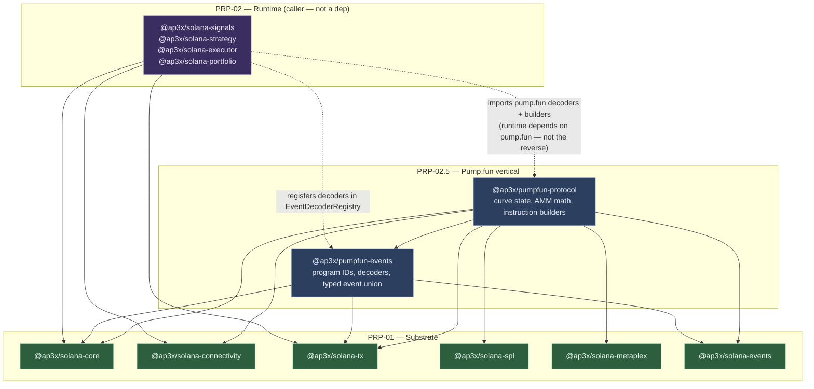
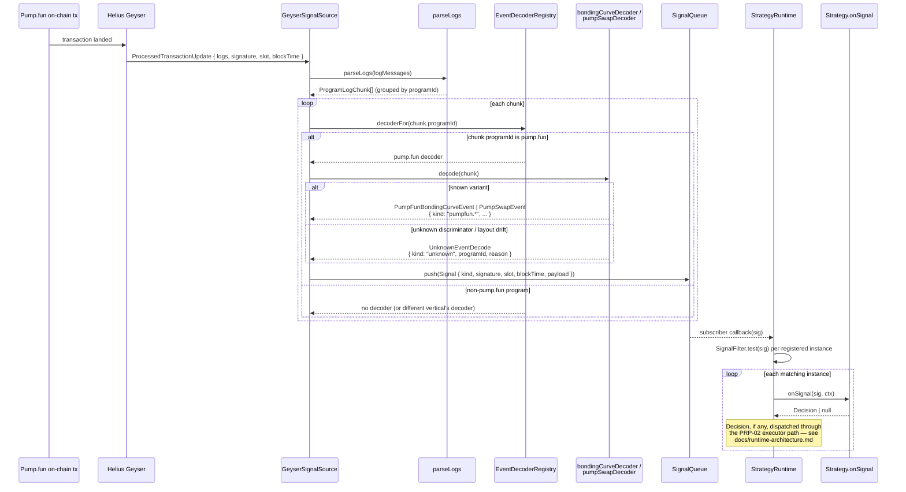
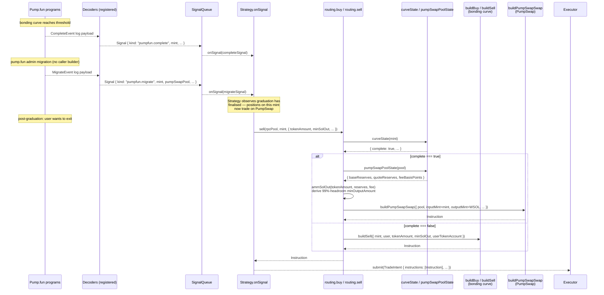

# PRP-02.5 Pump.fun Vertical Architecture

This document describes how the two pump.fun vertical packages —
`@ap3x/pumpfun-events` and `@ap3x/pumpfun-protocol` — sit on top of the PRP-01
Solana substrate and the PRP-02 runtime. It is aimed at PRP-03 implementers
(write-path safety) and strategy authors who will consume these packages to
read, decode, and build pump.fun instructions.

It assumes the reader is already familiar with the substrate and runtime
architecture documented in `docs/runtime-architecture.md`; this doc focuses on
the pump.fun-specific concerns: decoder registration, the bonding-curve /
PumpSwap graduation boundary, the typed read-only client, and the pure
instruction builder surface.

---

## Overview

Pump.fun is the first vertical on the platform. Two packages ship in PRP-02.5:

| Package | Role |
|---|---|
| `@ap3x/pumpfun-events` | Program IDs, log + CPI decoders for both pump.fun programs, typed event union |
| `@ap3x/pumpfun-protocol` | Typed read-only client, bonding-curve + AMM math, pure instruction builders, graduation-aware routing |

**Boundary rule.** `pumpfun-events` depends only on the substrate
(`@ap3x/solana-core`, `@ap3x/solana-events`, `@ap3x/solana-tx`). `pumpfun-protocol`
depends on the substrate plus `pumpfun-events` (it reuses the decoders inside
`fetchRecentTrades`). **Neither pump.fun package depends on any runtime
package.** The runtime depends on substrate only; the runtime is the caller
that wires pump.fun decoders into its `EventDecoderRegistry` and dispatches
pump.fun signals to strategies. This keeps pump.fun a true leaf vertical that
can be versioned and released independently.

**Zero ecosystem deps invariant holds.** No runtime dependency on
`@solana/web3.js`, `@solana/kit`, `@solana/spl-token`, or any
`@metaplex-foundation/*` package. The CI gate `Verify no forbidden deps`
applies across the monorepo and covers pump.fun packages too.

**Stateless.** `@ap3x/pumpfun-protocol` holds no lifecycle state, no
background tasks, no in-memory stream buffers. Live streaming is the runtime's
`SignalQueue` responsibility; callers wanting live pump.fun trades subscribe
to the queue filtering for `pumpfun.trade` / `pumpfun.swap` kinds. Historical
backfill of older windows lives in PRP-04's event store.

---

## Package Layering



**Key layering invariants:**

- `pumpfun-events` and `pumpfun-protocol` import **only** from substrate
  packages and from each other. No imports from `@ap3x/solana-signals`,
  `@ap3x/solana-strategy`, `@ap3x/solana-executor`, or
  `@ap3x/solana-portfolio`. This is enforced by
  `eslint-plugin-boundaries` (see `eslint.config.mjs`).
- The runtime imports pump.fun (not the reverse). In app boot code a caller
  does `registry.register(PUMPFUN_BONDING_CURVE_PROGRAM_ID, bondingCurveDecoder)`
  and `registry.register(PUMPFUN_PUMPSWAP_PROGRAM_ID, pumpSwapDecoder)` before
  starting the `GeyserSignalSource`. Other Solana verticals can register their
  own decoders against distinct programs and coexist in the same registry.
- Pure instruction builders return `Instruction` records (from
  `@ap3x/solana-tx`). They do not sign, submit, simulate, or wrap a wallet.
  The PRP-03 write-path safety layer is what will consume these builders and
  add simulate / receipt / policy gating; until PRP-03 lands a strategy that
  wants to submit must do it directly via the runtime's `Executor`.

---

## Sequence: live pump.fun event flow

The hot path. A pump.fun transaction lands on mainnet, Geyser pushes logs to
the runtime, the registered decoder produces a typed event, the
`SignalQueue` dispatches it to every subscribed strategy instance.



**Key points:**

- Decoders are **pure functions** `(ProgramLogChunk) => Event | UnknownEventDecode`.
  They never throw on malformed data; unknown discriminators or layout
  mismatches surface as typed `UnknownEventDecode` records with a structured
  `reason` string. This is the substrate invariant — zero silent drops.
- The bonding-curve decoder and the PumpSwap decoder are **registered
  separately** under different program IDs
  (`PUMPFUN_BONDING_CURVE_PROGRAM_ID` and `PUMPFUN_PUMPSWAP_PROGRAM_ID`
  respectively). A single pump.fun transaction touching both programs
  produces multiple decoded events, one per program chunk.
- Slot, signature, and `blockTime` from the Geyser update are attached to the
  signal envelope before it reaches the queue. Decoders themselves care only
  about the log payload bytes; tx-level metadata comes from the source.
- The `SignalFilter.test` call runs per registered strategy instance before
  `onSignal` fires. A strategy uninterested in a particular `kind` (e.g. only
  cares about `pumpfun.create` for launch-detection) never sees unrelated
  variants, which keeps the per-instance `InstanceQueue` idle for noise.

---

## Sequence: graduation boundary (Complete → Migrate → Swap)

Pump.fun tokens migrate from the bonding curve to PumpSwap when the curve
hits its graduation threshold. For a strategy tracking a live position, this
boundary is where routing has to change program and account layout. The
unified `routing.buy` / `routing.sell` helpers hide the boundary: the same
call works before, during, and after graduation.



**Key points:**

- `CompleteEvent` and `MigrateEvent` are distinct decoded variants on the
  bonding-curve program. `CompleteEvent` fires when the curve reaches
  graduation threshold; `MigrateEvent` fires when pump.fun's admin path
  performs the actual migration of reserves to PumpSwap. Strategies should
  key off `pumpfun.migrate` (not `pumpfun.complete`) as the authoritative
  "token now lives on PumpSwap" signal — there is a short window between the
  two where the pool may not yet be fully initialised.
- `routing.buy` / `routing.sell` perform one `curveState` RPC round-trip per
  invocation, plus one `pumpSwapPoolState` round-trip on the post-graduation
  branch. Strategies trading the same mint in a tight loop should cache the
  state and call the raw builders (`buildBuy`, `buildSell`,
  `buildPumpSwapSwap`) directly to avoid repeated round-trips.
- Post-graduation slippage is derived from live pool reserves. `routing.buy`
  computes `ammTokensOut` from `(solIn, reserves, fee)` and applies a 1%
  headroom (× 99/100) as `minOutputAmount`. `routing.sell` computes
  `ammSolOut` symmetrically; the caller's `minSolOut` acts as an additional
  floor when non-zero and tighter than the computed headroom — the router
  never silently loosens a caller's bound.
- There is **no `buildMigrate` builder.** Migration is triggered by the
  pump.fun program itself on an admin path. Callers cannot — and should not —
  construct migration instructions. The decoded `MigrateEvent` is observation
  only.

---

## `buildCreate` and the initial-buy composition note

**`buildCreate` does not include an initial buy.** It emits a single
`Instruction` that creates the pump.fun mint and initialises the bonding
curve. It does **not** bundle a subsequent `buildBuy` for the creator's first
purchase.

Consumers who want an atomic create-plus-snipe (the common "launch and buy
the dev supply in the same tx" pattern) compose the two builders at the call
site:

```typescript
const ixs = [
  buildCreate(createParams),
  buildBuy(initialBuyParams),
];
const tx = await assemble({ instructions: ixs, payer, signers, blockhash });
```

This keeps both builders pure single-responsibility functions and keeps the
decision about whether to bundle, and at what slippage, in the caller's
hands. A few consequences:

- The creator's `userTokenAccount` (ATA for the new mint) must exist before
  `buildBuy` runs. If it does not, the caller prepends an
  `createAssociatedTokenAccountIx` from `@ap3x/solana-spl` to the bundle.
- The initial-buy amount and the create's `initialVirtualSolReserves` are
  independent parameters. A caller may choose a curve shape and a buy size
  separately.
- A formal launch-and-snipe orchestrator — with vanity-mint grinding, bundle
  sizing, priority-fee tiering for the launch slot, and safety guards around
  Tier-3 irreversible operations like authority revocation — ships in
  **PRP-03.5** alongside the execution-safety write path. PRP-02.5 stops at
  the pure builders.

---

## Typed read-only client

`@ap3x/pumpfun-protocol` ships a stateless, one-shot-RPC read client:

| Method | Purpose |
|---|---|
| `curveState(rpcPool, mint)` | Reads the bonding-curve account; returns typed reserves + `complete` + creator + `createdAt` |
| `pumpSwapPoolState(rpcPool, pool)` | Reads the PumpSwap pool account; typed reserves + LP mint + authorities + fee bps |
| `metadata(rpcPool, mint)` | Composes Metaplex on-chain metadata decode + `MetadataResolver.resolve(uri)` |
| `holders(rpcPool, mint, limit)` | Wraps `@ap3x/solana-spl` largest-accounts / accounts-by-mint |
| `creator(rpcPool, mint)` | Derived from `curveState` |
| `fetchRecentTrades(rpcPool, mint, window)` | `getSignaturesForAddress` + `getTransaction` + decode; one-shot, no subscription |

Every method is a pure request/response. There is **no lifecycle, no
polling, no cache invalidation.** Strategies wanting live streaming subscribe
to the runtime's `SignalQueue`. Strategies wanting historical windows wait
for PRP-04's event store (or scan signatures themselves via
`fetchRecentTrades` for small one-off queries).

---

## Pure instruction builders

All builders return `{ programId, accounts, data }` records compatible with
`@ap3x/solana-tx`'s `assemble`. None of them sign, simulate, or submit.

| Builder | Inputs | Output program |
|---|---|---|
| `buildCreate(params: CreateParams)` | name, symbol, uri, mint, creator, authority | bonding curve |
| `buildBuy(params: BuyParams)` | mint, user, solIn, maxSolCost, userTokenAccount | bonding curve |
| `buildSell(params: SellParams)` | mint, user, tokenAmount, minSolOut, userTokenAccount | bonding curve |
| `buildPumpSwapSwap(params: PumpSwapSwapParams)` | pool, user, input/output mints + accounts, inputAmount, minOutputAmount | PumpSwap AMM |

**Not in scope for PRP-02.5:** `buildMigrate` (admin-only; see above),
`buildSetParams` (admin-only), authority-revocation builders (Tier-3
irreversible — live in PRP-03.5 alongside their policy gating), vanity mint
grinding, launch-and-snipe orchestration, airdrop distribution.

---

## Known program-upgrade gotchas + the nightly diag gate

Pump.fun is an actively maintained program. Its authors can — and do — ship
upgrades that change discriminators, account layouts, or event field
ordering. Our defenses against layout drift:

### Defense 1 — Tolerant decoders, structured unknowns

Decoders never throw on malformed bytes. Any unknown discriminator or
short-read emits `UnknownEventDecode { kind: "unknown", programId, reason }`
with a `reason` string describing the failure mode
(`"short read on CreateEvent name"`, `"unknown discriminator 0xDEADBEEF..."`,
etc.). These records flow through the `SignalQueue` like any other signal —
strategies can filter on `kind === "unknown"` to alarm on drift without
crashing the pipeline.

### Defense 2 — Nightly diag probe

`.github/workflows/ci.yml` runs `pumpfun-nightly-diag` on a `schedule: cron:
'17 5 * * *'` trigger (05:17 UTC). The job installs the monorepo and runs
`pnpm --filter @ap3x/pumpfun-events run diag`, which:

1. Fetches ~20 recent signatures per pump.fun program from a Helius RPC
   endpoint.
2. Pulls each transaction's log payload.
3. Runs both decoders.
4. Computes the ratio of `UnknownEventDecode` outputs to total decoded
   chunks per program.
5. **Fails the CI run (exit 1) if the ratio exceeds 10% for a program we know
   has observed variants.** Below 10% is treated as normal (pump.fun emits
   noise, some non-payload logs).
6. Self-skips (exit 0, no failure) when `HELIUS_API_KEY` is unset — the job
   doesn't break on secret rotation windows or forks.

When the diag fails, the runbook `docs/runbook/pumpfun-fixture-refresh.md`
walks through: pulling a fresh sample, re-running the capture scripts in
`tests/helpers/capture/`, inspecting layout diffs, updating the decoder, and
regenerating the curve / AMM math regression fixtures. Cadence: on-demand
when the diag alarms or when the team notices observable drift.

### Defense 3 — Roundtrip builder tests

Each instruction builder has a roundtrip test: build the instruction,
assemble a tx via `@ap3x/solana-tx`, simulate it against devnet or a mainnet
fork, decode the simulation result, assert the decoded event matches the
params the builder was called with. When pump.fun upgrades the builder's
expected account order or data encoding, the roundtrip test fails before
production code breaks.

### Defense 4 — Fixture regression suite

`tests/fixtures/pumpfun-per-variant.jsonl.gz` (~100 events, one per variant)
and `tests/fixtures/pumpfun-lifecycle.jsonl.gz` (~500 events, full
create → trade → complete → migrate → swap traces for 2-3 tokens) catch
decoder regressions at `pnpm test`. Both are captured via Helius free tier;
capture scripts live at `tests/helpers/capture/capture-pumpfun-*.ts`.

---

## Unverified assumptions and known risk areas

Two areas of the PRP-02.5 surface shipped with real-captured fixtures
validating the happy path, but the team flagged them as "confirm under
production load before relying on edge cases":

### PumpSwap pool account layout

The PumpSwap AMM is the post-graduation side of the boundary. Pump.fun did
not publish a canonical Anchor IDL at the time of PRP-02.5 capture; the
account layout used by `pumpSwapPoolState` was derived from observed
accounts plus cross-reference with the pump.fun team's (unofficial) source
drops. The diag probe exercises live decode nightly, but any field added or
reordered in a silent upgrade would not show up as an
`UnknownEventDecode` — account decode is separate from log decode. **Risk
mitigation: treat `pumpSwapPoolState` drift as a manual check when the diag
alarms; re-read against a freshly observed account if field values look
off.**

### PumpSwap event discriminators

PumpSwap's `SwapEvent` / `AddLiquidityEvent` / `RemoveLiquidityEvent` /
admin-event discriminators were also observed rather than pulled from an
IDL. The nightly diag's 10% unknown-ratio threshold would catch a wholesale
discriminator shift (the entire post-graduation stream would start
decoding as unknown), but a subtle change — e.g. a new admin variant added
between existing ones — could go unnoticed if the new variant is rare in
mainnet traffic. **Risk mitigation: refresh the per-variant fixture
periodically (monthly cadence is sufficient) to catch the long-tail of new
variants the diag's small sample might miss.**

When either of these ships a confirmed layout, the corresponding
`UnknownEventDecode` `reason` strings should be cleaned up to reference the
verified source. Until then the diag + fixtures combination is the production
safety net.

---

## References

- PRP spec: `roadmap/02.5-pumpfun-protocol.md`
- Design: `docs/superpowers/specs/2026-04-20-prp-02.5-pumpfun-protocol-design.md`
- Plan: `docs/superpowers/plans/2026-04-20-prp-02.5-pumpfun-protocol.md`
- Runtime architecture (upstream): `docs/runtime-architecture.md`
- Fixture refresh runbook: `docs/runbook/pumpfun-fixture-refresh.md`
- Key source files:
  - `packages/pumpfun-events/src/program-ids.ts` — program ID constants
  - `packages/pumpfun-events/src/bonding-curve/decoder.ts` — bonding-curve decoder
  - `packages/pumpfun-events/src/pumpswap/decoder.ts` — PumpSwap decoder
  - `packages/pumpfun-protocol/src/routing.ts` — graduation-aware `buy` / `sell`
  - `packages/pumpfun-protocol/src/curve/state.ts` — `curveState` read client
  - `packages/pumpfun-protocol/src/pumpswap/pool-state.ts` — `pumpSwapPoolState`
  - `packages/pumpfun-protocol/src/instructions/create.ts` — `buildCreate`
  - `packages/pumpfun-protocol/src/instructions/buy.ts` — `buildBuy`
  - `packages/pumpfun-protocol/src/instructions/sell.ts` — `buildSell`
  - `packages/pumpfun-protocol/src/instructions/pumpswap-swap.ts` — `buildPumpSwapSwap`
  - `packages/pumpfun-events/scripts/diag.ts` — nightly diag probe
  - `.github/workflows/ci.yml` — `pumpfun-nightly-diag` job
