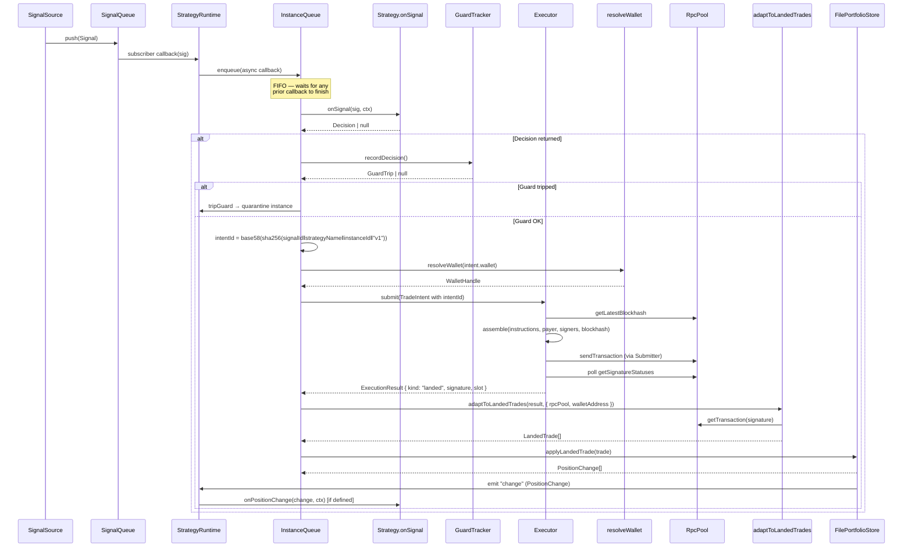
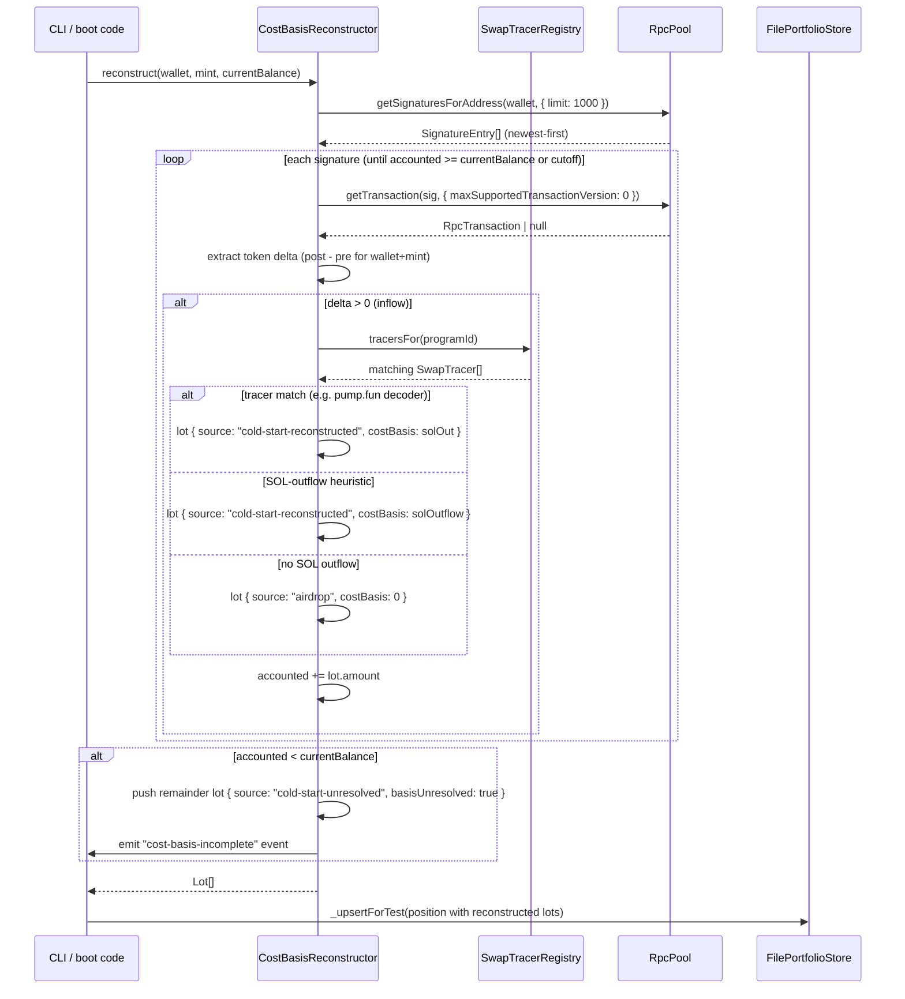
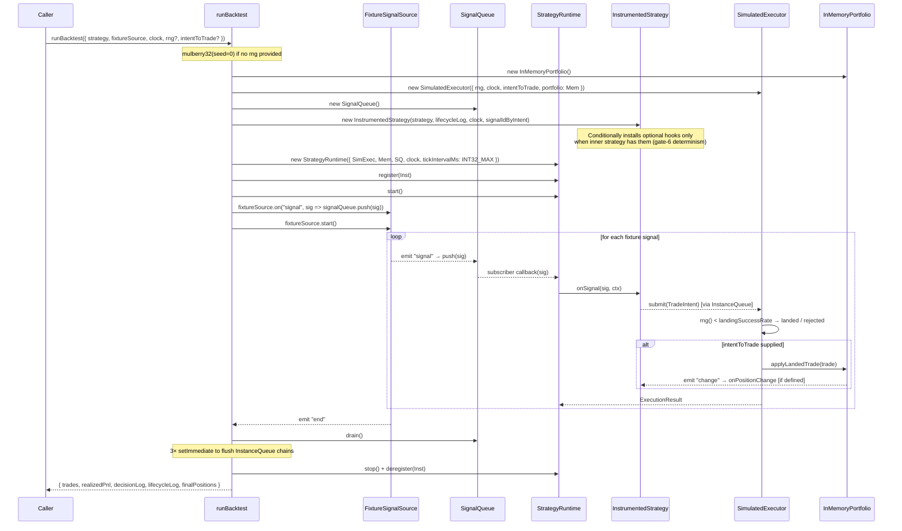
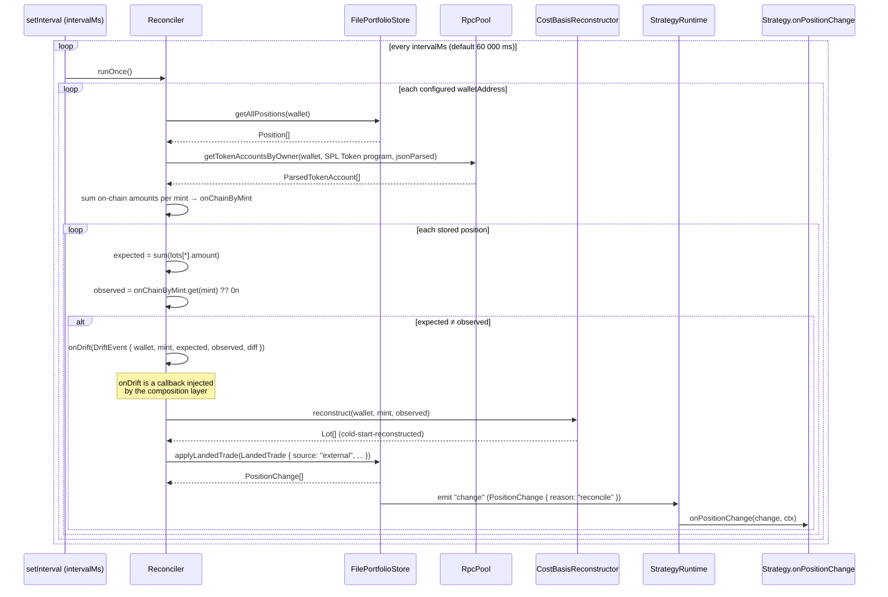

# PRP-02 Runtime Architecture

This document describes the wiring of the four PRP-02 runtime packages —
`@ap3x/solana-signals`, `@ap3x/solana-strategy`, `@ap3x/solana-executor`, and
`@ap3x/solana-portfolio` — for PRP-03 implementers and future maintainers. It
assumes the reader knows Solana fundamentals (accounts, transactions, slots,
lamports) and is comfortable with TypeScript async patterns.

---

## Overview

PRP-02 delivers a **signals → strategy → executor → portfolio** pipeline on top
of the PRP-01 substrate. The four packages are deliberately loosely coupled:

| Package | Role |
|---|---|
| `@ap3x/solana-signals` | Typed signal bus (`SignalQueue`, `FixtureSignalSource`, `CheckpointStore`) |
| `@ap3x/solana-strategy` | `StrategyRuntime` orchestrator + `Strategy` base class + backtest harness |
| `@ap3x/solana-executor` | `Executor` — intent submission, fee-tier routing, submitter failover, retry |
| `@ap3x/solana-portfolio` | `FilePortfolioStore`, `CostBasisReconstructor`, `Reconciler`, CLI |

**Boundary rule:** `signals` and `portfolio` are fully independent of each
other. `executor` is independent of both. `strategy` (`StrategyRuntime`)
orchestrates all three via narrow `ExecutorLike` and `PortfolioLike` interfaces
defined in `packages/solana-strategy/src/runtime.ts`.

**Zero ecosystem deps invariant:** No runtime dependency on
`@solana/web3.js`, `@solana/kit`, `@solana/spl-token`, or any
`@metaplex-foundation/*` package. The only permitted exceptions are
`@noble/ed25519` (PDA off-curve check) and `libsodium-wrappers` (vault crypto).
CI gate `Verify no forbidden deps` enforces this.

---

## Package Responsibilities

| Package | Public surface | Internal-only | Upstream deps |
|---|---|---|---|
| `solana-signals` | `Signal`, `SignalQueue`, `FixtureSignalSource`, `CheckpointStore` | `signal-id.ts` | `@ap3x/solana-core` |
| `solana-strategy` | `Strategy`, `StrategyRuntime`, `runBacktest`, `intentId` | `InstanceQueue`, `GuardTracker`, `InstrumentedStrategy` | signals, executor, portfolio, vault, connectivity |
| `solana-executor` | `Executor`, `TradeIntent`, `ExecutionResult`, `BUMP_PROGRESSION` | `InFlightMap`, `BundleAccumulator`, `confirmLanded` | core, connectivity, tx, vault |
| `solana-portfolio` | `FilePortfolioStore`, `CostBasisReconstructor`, `Reconciler`, portfolio CLI | `reduceLots`, `SplTransferSwapTracer` | core, connectivity |

---

## Sequence Diagrams

### 1. Live signal → strategy → executor → portfolio

The primary hot path. A signal arrives on the queue, passes through the
per-instance dispatch queue inside `StrategyRuntime`, and ultimately writes a
`PositionChange` back to the portfolio store.



**Key invariants:**

- The entire callback — `onSignal` + guard check + `executor.submit` +
  `adaptToLandedTrades` + `portfolio.applyLandedTrade` — runs inside the
  `InstanceQueue` for that strategy instance. Two concurrent signals for the
  same instance can never interleave; each queues behind the previous (see
  `packages/solana-strategy/src/instance-queue.ts:18`).
- `executor.submit` is called **inside** the queue callback, not alongside it.
  This is Advisor note 4 / gate-6 determinism: serial ordering of submit
  relative to hooks prevents concurrent `intentId` conflicts and out-of-order
  portfolio mutations.
- Different registered strategy instances run **concurrently** (each has its
  own `InstanceQueue`). Only within one instance is ordering strictly FIFO.
- `adaptToLandedTrades` returns `[]` for any non-`landed` result (`timeout`,
  `dropped`, `reverted`, `rejected`). No portfolio write occurs for failed
  submissions.
- The portfolio `'change'` event is emitted by `FilePortfolioStore` after every
  `applyLandedTrade` call, regardless of whether the runtime itself caused that
  trade. Strategies receive the unified stream — both executor-sourced and
  reconciler-sourced changes arrive through `onPositionChange`.

**`LandedTrade.source` field:** Trades produced by this path carry
`source: 'executor'`. Trades injected by the reconciler carry
`source: 'external'` (see [Diagram 5](#5-portfolio-drift--reconciliation)).

---

### 2. Cold-start cost-basis reconstruction

When the agent starts up with an existing token balance but no local portfolio
history, `CostBasisReconstructor` walks on-chain transaction history to build
lot records.



**Algorithm (spec §3.4 — 4 steps):**

1. Pull up to 1000 recent signatures via `getSignaturesForAddress`, newest-first,
   capped at `lookbackDays` (default 90). Signatures without `blockTime` are
   walked rather than skipped — we err on the side of coverage.
2. For each signature, fetch the full transaction and compute the token delta for
   `(wallet, mint)` from `preTokenBalances` / `postTokenBalances`. Zero and
   negative deltas are skipped.
3. Classify each inflow. Registered `SwapTracer` implementations win first (they
   have richer knowledge than the heuristic — a pump.fun decoder can pull the
   exact lamport outflow from log events). The fallback is a SOL-outflow
   heuristic: `preBalance - postBalance - fee` for the fee payer. When there is
   no SOL outflow either, the lot is classified as `airdrop` with zero cost basis.
4. Accumulate lots newest-first, stopping as soon as `accounted >= currentBalance`
   (greedy stopping condition). If the signature window is exhausted before the
   balance is covered, a `cold-start-unresolved` lot absorbs the remainder with
   `basisUnresolved: true`. A `'cost-basis-incomplete'` event fires so callers
   can alert or log.

**`basisUnresolved` semantics:** This flag propagates from a lot through FIFO
lot reduction (`reduceLots` in `accounting.ts`) to the `RealizedPnlEvent`. It
signals that the realized PnL figure for that sale is unreliable because the
purchase cost was unknown. Downstream reporting should surface this as a
caveat rather than treat the number as authoritative.

**Lot source taxonomy:**

| `source` value | Meaning |
|---|---|
| `trade` | Created by `applyLandedTrade` from live executor path |
| `cold-start-reconstructed` | Swap identified by tracer or SOL-outflow heuristic |
| `cold-start-unresolved` | Remainder when reconstruction window runs dry |
| `transfer-in` | Inbound transfer identified by a tracer |
| `airdrop` | Inflow with no SOL outflow and no tracer match |

---

### 3. Backtest flow

`runBacktest` in `packages/solana-strategy/src/backtest.ts` wires the same
`StrategyRuntime` used in production but substitutes all I/O with deterministic
in-memory fakes. The diagram shows the composition layer.



**Substitution points:**

| Real component | Backtest substitute | Where injected |
|---|---|---|
| `Executor` | `SimulatedExecutor` (internal) | `StrategyRuntime.executor` |
| `FilePortfolioStore` | `InMemoryPortfolio` (internal) | `StrategyRuntime.portfolio` |
| `SignalQueue` (live source) | `FixtureSignalSource` → `SignalQueue` bridge | `opts.fixtureSource` |
| `Date.now()` | `opts.clock` counter | `StrategyRuntime.clock`, `SimulatedExecutor.clock` |
| `Math.random()` | `opts.rng` / mulberry32 | `SimulatedExecutor.rng` |
| `FileStrategyStateStore` | `InMemoryStrategyStateStore` | `stateStoreFactory` override |
| `RpcPool` (adapter fetch) | `noopRpcPool` (returns `null`) | `StrategyRuntime.rpcPool` |

**Gate-6 determinism invariants:**

- No `Date.now()` or `Math.random()` calls anywhere in `backtest.ts`.
- The default PRNG is `mulberry32` seeded at `0` per run — identical seeds
  produce identical sequences.
- `tickIntervalMs` is set to `2_147_483_647` (max safe 32-bit signed integer)
  to suppress the tick interval entirely. The backtest is signal-driven.
- `InstrumentedStrategy` conditionally installs optional hooks (e.g.
  `onExecutionResult`, `onPositionChange`) **only** when the inner strategy
  defines them. If the inner strategy lacks `onExecutionResult`, the runtime
  never dispatches it and never consumes a clock tick for it. This keeps
  `lifecycleLog` and `decisionLog` byte-identical across runs for a given
  inner strategy.
- `SimulatedExecutor` bypasses `adaptToLandedTrades` entirely. When
  `intentToTrade` is supplied, it calls `portfolio.applyLandedTrade` directly
  with the caller-provided trade shape. No RPC fetch occurs.

**`intentToTrade` callback (Option C):** Strategy authors who want portfolio
tracking during backtests supply this callback. The harness does not inspect
opaque `instructions` arrays — it cannot know what token mint a given
instruction affects. If the callback is omitted, decisions and lifecycle are
still captured in `decisionLog` / `lifecycleLog`; portfolio positions just
remain empty.

---

### 4. Executor failover + retry

`Executor.submit` selects submitters from a priority-ordered fallback chain and
drives a retry loop with optional fee-tier bump progression.

```mermaid
sequenceDiagram
    accTitle: Executor failover and retry with fee-tier bump
    accDescr: Executor picks a healthy submitter from the fallback chain and retries with fee-tier progression on timeout or transient failure

    participant Strat as StrategyRuntime
    participant Exec as Executor
    participant InFlight as InFlightMap
    participant Jgrpc as JitoGrpcSubmitter
    participant Jhttp as JitoHttpSubmitter
    participant RpcSub as RpcSubmitter
    participant Conf as confirmLanded

    Strat->>Exec: submit(intent { feeTier: "med", retry: { maxAttempts: 3, bumpProgression: true } })
    Exec->>InFlight: run(intentId, callback)
    Note over InFlight: Duplicate intentId attaches to<br/>existing slot — no parallel retry

    loop attempt 1 (tier: "med")
        Exec->>Exec: emit "executor.attempt" { attempt: 1, feeTier: "med" }
        Exec->>Exec: resolveWallet(intent.wallet)
        Exec->>Exec: feeEstimator.tier("med") → microLamportsPerCu
        Exec->>Exec: rpcPool.getLatestBlockhash
        Exec->>Exec: assemble + sign (v0 transaction)
        Exec->>Jgrpc: health()
        Jgrpc-->>Exec: { state: "unhealthy" }
        Exec->>Jhttp: health()
        Jhttp-->>Exec: { state: "healthy" }
        Exec->>Jhttp: submit({ kind: "tx", signedTx })
        Jhttp-->>Exec: SubmissionAck { signature }
        Exec->>Conf: confirmLanded({ signature, deadline })
        Conf->>RpcSub: poll getSignatureStatuses
        Conf-->>Exec: { kind: "timeout" }
        Note over Exec: timeout → retryable; bump tier med → high
    end

    loop attempt 2 (tier: "high")
        Exec->>Exec: emit "executor.attempt" { attempt: 2, feeTier: "high" }
        Exec->>Exec: resolveWallet + getLatestBlockhash + assemble + sign
        Exec->>Jhttp: submit({ kind: "tx", signedTx })
        Jhttp-->>Exec: SubmissionAck { signature }
        Exec->>Conf: confirmLanded({ signature, deadline })
        Conf-->>Exec: { kind: "landed", slot, landedAt }
        Exec->>Exec: emit "result" { kind: "landed", intentId, signature, slot }
    end

    Exec-->>InFlight: ExecutionResult { kind: "landed" }
    InFlight-->>Strat: ExecutionResult { kind: "landed" }
```

**Submitter selection (`#pickSubmitter`):**

The executor builds an ordered list starting with the `intent.submitter.kind`
(or `defaultSubmitter` if unset), followed by the remaining entries of
`fallbackChain` (default `['jito-grpc', 'jito-http', 'rpc']`). It walks the
list and returns the first entry whose `health().state !== 'unhealthy'`.
`'degraded'` is accepted — the executor does not distinguish degraded from
healthy when picking a submitter, only unhealthy is skipped.

**Fee-tier progression (`BUMP_PROGRESSION`):**

`['low', 'med', 'high', 'turbo']`

When `intent.retry.bumpProgression === true` and the previous attempt returned
a retryable result, the tier advances one step before the next attempt. At
`'turbo'` the tier plateaus — subsequent retries stay at `'turbo'`.

**Retryable vs terminal results:**

| Result | Retry behaviour |
|---|---|
| `landed` | Terminal — loop stops (success) |
| `reverted` | Terminal — loop stops (on-chain failure) |
| `rejected` with `reserve_breach` | Terminal — vault refused the SOL reserve check |
| `rejected` with `sign_failed` | Terminal — signing error |
| `rejected` with `wallet_locked` | Terminal — `resolveWallet` threw |
| `rejected` with `no_jito_submitter_for_bundle` | Terminal — config error, hoisted before `inFlight.run` |
| `timeout` | Retryable |
| `dropped` | Retryable |
| `rejected` with `submit_failed` | Retryable (transient RPC fault) |
| `rejected` with `blockhash_fetch_failed` | Retryable (transient) |
| `rejected` with `bundle_flush_failed` | Retryable (transient) |
| `rejected` with `no_submitter` | Retryable (all submitters unhealthy) |

**`InFlightMap` dedup:** If a second caller submits the same `intentId` while
the first attempt (including retries) is still in flight, `inFlight.run` attaches
the second caller to the existing promise chain. Both callers receive the same
final `ExecutionResult` after all retries complete — no parallel retry cycle is
spawned.

**`'executor.attempt'` event:** Emitted at the start of every attempt,
1-indexed, before wallet resolution. This gives a correlated log/metrics
pipeline a consistent signal for each attempt regardless of which phase of the
previous attempt failed. See `packages/solana-executor/src/executor.ts:233`.

---

### 5. Portfolio drift + reconciliation

`Reconciler` runs a periodic pass comparing local lot-sum balances with live
on-chain token account balances. Detected drift triggers the `onDrift` callback
supplied by the composition layer.



**Drift detection math:** For each stored `Position`, `expected` is the sum of
`lot.amount` across all lots. `observed` is the raw token amount from
`getTokenAccountsByOwner` for that mint. Any difference (including
`observed === 0n` when a position was externally closed) fires `onDrift`.

**`PositionChange.reason`:** Reconciliation-triggered changes carry
`reason: 'reconcile'` (see `packages/solana-portfolio/src/types.ts:43`).
Strategies that implement `onPositionChange` can branch on `change.reason` to
distinguish live-trade updates from reconciliation corrections.

**`LandedTrade.source: 'external'`:** Trades synthesized during reconciliation
use `source: 'external'` to distinguish them from `'executor'`-sourced trades.
This propagates to the lot's `source` field in the portfolio store and to any
`RealizedPnlEvent` emitted if the reconciliation results in a lot reduction.

**Tolerance window:** The current implementation performs an exact integer
comparison (`expected !== observed`). There is no tolerance band — any
discrepancy triggers `onDrift`. A tolerance gate is a potential PRP-03
enhancement.

**Note on diagram simplification:** The diagram shows the composition layer
calling `Reconstr.reconstruct` + `Store.applyLandedTrade` inside the `onDrift`
callback. The actual wiring of this callback is the responsibility of the
application boot code or CLI, not the `Reconciler` itself. `Reconciler` only
calls `onDrift`; what `onDrift` does is caller-defined.

---

## Design Invariants

### `onError` synchronous semantics

```typescript
onError?(err: Error, phase: HookPhase, ctx: StrategyContext): void
```

- The return type is `void`, **not** `Promise<void>`. Implementors MUST NOT
  return a promise or `await` anything inside `onError`.
- Called synchronously from `callHook`'s `catch` clause in
  `packages/solana-strategy/src/runtime.ts:419`.
- The runtime wraps the `onError` call in its own `try/catch`. A throwing
  reporter is silently swallowed — it must not propagate and break the internal
  error path.
- Rationale: error reporting is a fast-path side-effect. Introducing async
  latency or a hang on `await` inside `onError` would block the `InstanceQueue`
  chain for the duration, delaying all subsequent dispatches for that instance.

### `intentId` derivation

```typescript
// packages/solana-strategy/src/intent-id.ts
export function intentId(input: IntentIdInput): string {
  // result = base58(sha256(signalId \x00 strategyName \x00 instanceId \x00 decisionVersion))
}
```

- Formula: `base58(sha256(signalId ‖ NUL ‖ strategyName ‖ NUL ‖ instanceId ‖ NUL ‖ decisionVersion))`
- `decisionVersion` defaults to `'v1'`. A strategy can bump it to deliberately
  re-issue a decision for the same `(signal, strategy, instance)` quad without
  changing any other field.
- The NUL separator is load-bearing: it prevents the concatenation collision
  `("ab","c") === ("a","bc")`. Test 8 in
  `packages/solana-strategy/src/intent-id.test.ts` proves this invariant.
- Same `(strategy, instance, signal)` always produces the same intent ID —
  enabling `InFlightMap` dedup across transient reconnects.
- Two **different** registered instances of the same strategy watching the same
  signal produce **distinct** intent IDs (because `instanceId` differs). There
  is no cross-instance collision.

### `resolveWallet` seam

```typescript
// Both StrategyRuntime and Executor receive this signature — not vault: Vault
resolveWallet: (name: string) => Promise<WalletHandle>
```

- Neither `StrategyRuntime` nor `Executor` holds a `Vault` reference or
  interacts with passphrases. The composition layer (CLI, service boot, test
  harness) owns passphrase resolution and constructs the `resolveWallet` closure
  before passing it in.
- If `resolveWallet` throws, the executor surfaces
  `ExecutionResult { kind: 'rejected', error: { code: 'wallet_locked' } }`.
  This is a terminal result — the retry loop does not re-attempt after a
  `wallet_locked` rejection.
- `StrategyRuntime` caches resolved wallet addresses in a per-instance
  `Map<string, PublicKey>` after the first lookup (addresses are immutable).
  Subsequent signals for the same wallet name skip the `resolveWallet` call
  entirely (see `packages/solana-strategy/src/runtime.ts:341`).

### Per-instance dispatch queue + gate-6 determinism

```typescript
// packages/solana-strategy/src/instance-queue.ts
export class InstanceQueue {
  enqueue<T>(task: () => Promise<T> | T): Promise<T> { ... }
}
```

Each registered strategy instance owns a private `InstanceQueue` — a
promise-chain FIFO. All hook dispatches (`onSignal`, `onExecutionResult`,
`onPositionChange`, `onTick`, `onStart`, `onShutdown`) run through this queue.
`executor.submit` **also** runs inside the queue callback (alongside the
`onSignal` hook call), not in a separate concurrent path.

Rationale (Advisor note 4 / Decision 4 in the design spec):

> Serialising `executor.submit` relative to hook calls ensures two signals for
> the same instance can never submit concurrently, which would produce
> interleaved `intentId` conflicts or out-of-order portfolio mutations.

Backtest consequence: because the same `InstanceQueue` serialization applies in
the test harness (via the real `StrategyRuntime`), backtest output is
deterministic for any signal ordering, not just trivially sequential inputs.

Sync tasks are valid in `enqueue` — the signature accepts
`() => Promise<T> | T`. Wrapping synchronous work in a `Promise` is
unnecessary.

### Bundle accumulator semantics

`BundleAccumulator` (in `packages/solana-executor/src/bundle-accumulator.ts`)
groups `bundleGroup`-tagged intents and submits them as a Jito bundle.

- **Non-blocking:** each `add(group, entry)` call returns a `Promise<string>`
  that resolves to the per-intent signature once the bundle flushes. The caller
  does not wait for other intents in the same group.
- **Flush triggers:** either the `windowMs` timer expires (default 50 ms) or
  `maxPerBundle` intents accumulate (default 5). These are configurable via
  `ExecutorOpts.bundleWindowMs` and `ExecutorOpts.bundleMaxIntents`.
- **Per-entry signature:** Jito acknowledges a bundle with a single `bundleId`.
  The accumulator synthesizes per-entry identifiers as `${bundleId}-${i}`.
  Real signature recovery from bundle UUID is deferred to PRP-03.
- **Config validation:** bundle-path intents require at least one healthy Jito
  submitter. This is validated synchronously before `inFlight.run` (Advisor
  note 1), so a misconfigured call fails fast at the API boundary with
  `{ kind: 'rejected', error: { code: 'no_jito_submitter_for_bundle' } }`
  without poisoning the in-flight slot.

### `ExecutorLike` / `PortfolioLike` interfaces

Narrow interfaces defined inline in `runtime.ts` allow test fakes to satisfy
the runtime without implementing the full class surface:

```typescript
// packages/solana-strategy/src/runtime.ts
export interface ExecutorLike {
  submit(intent: TradeIntent): Promise<ExecutionResult>;
  on(event: string, handler: (...args: unknown[]) => void): unknown;
}

export interface PortfolioLike extends PortfolioReadApi {
  applyLandedTrade(trade: LandedTrade): Promise<PositionChange[]>;
  on(event: string, handler: (...args: unknown[]) => void): unknown;
}
```

`FilePortfolioStore` and `Executor` both structurally satisfy their `Like`
counterparts. The backtest harness's `SimulatedExecutor` and `InMemoryPortfolio`
satisfy only the narrow interfaces — they do not implement the full class API.

### Zero ecosystem deps posture

No package in this repo carries a runtime dependency on `@solana/web3.js`,
`@solana/kit`, `@solana/spl-token`, or any `@metaplex-foundation/*` package.
Permitted exceptions: `@noble/ed25519` and `libsodium-wrappers`. The CI gate
`Verify no forbidden deps` (in the Turbo pipeline) enforces this at build time.

---

## Known Gaps (Forward-Looking)

Items deferred from the PRP-02 backlog — not present in the current codebase:

| ID | Description | Gate / Blocker |
|---|---|---|
| B8 | Live Geyser source wiring (gate 1) | Helius Business plan required |
| B9 | Live Jito bundle submission end-to-end (gate 9) | Jito searcher credentials required |
| B10 | Devnet reconciler drift test (gate 7) | Free-tier RPC, gated on wiring |
| B11 | Expanded cost-basis reconstruction fixtures | Optional, enhances coverage |
| B12 | Cold-start tx-history fixture fallback | Free-tier-gated |
| — | Real per-tx signature recovery from bundle UUID | Deferred to PRP-03 |
| — | `onBalanceChange` wiring | PRP-03 (pump.fun vertical) |
| — | pump.fun-specific decoders + strategy | PRP-03 |
| — | Phase A typecheck regression in `solana-signals/src/signal-queue.test.ts:10` | Pre-existing; documented in Phase D close-out |

---

## References

- Spec: `docs/superpowers/specs/2026-04-19-prp-02-solana-runtime-design.md`
- Plan: `docs/superpowers/plans/2026-04-19-prp-02-solana-runtime.md`
- Advisor log: `docs/superpowers/advisor-log-2026-04-19-prp-02.md`
- Key source files:
  - `packages/solana-strategy/src/runtime.ts` — `StrategyRuntime`, `ExecutorLike`, `PortfolioLike`
  - `packages/solana-strategy/src/instance-queue.ts` — `InstanceQueue` (FIFO chain)
  - `packages/solana-strategy/src/intent-id.ts` — `intentId` derivation
  - `packages/solana-strategy/src/backtest.ts` — `runBacktest`, `SimulatedExecutor`, `InstrumentedStrategy`
  - `packages/solana-strategy/src/landed-trade-adapter.ts` — `adaptToLandedTrades`
  - `packages/solana-executor/src/executor.ts` — `Executor`, `BUMP_PROGRESSION`
  - `packages/solana-executor/src/bundle-accumulator.ts` — `BundleAccumulator`
  - `packages/solana-executor/src/confirm-landed.ts` — `confirmLanded`
  - `packages/solana-portfolio/src/store-file.ts` — `FilePortfolioStore`
  - `packages/solana-portfolio/src/reconstructor.ts` — `CostBasisReconstructor`
  - `packages/solana-portfolio/src/reconciler.ts` — `Reconciler`
  - `packages/solana-portfolio/src/types.ts` — `LandedTrade`, `Lot`, `PositionChange`, `DriftEvent`
